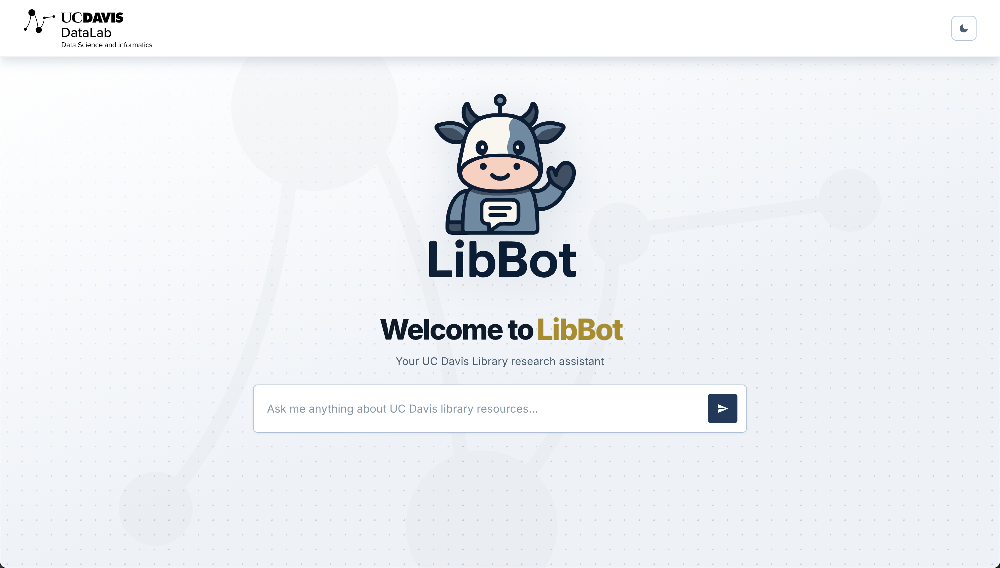
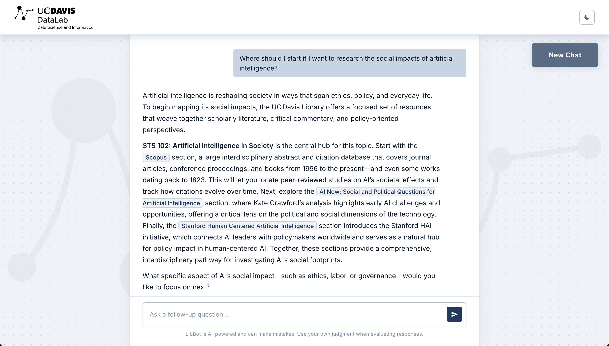
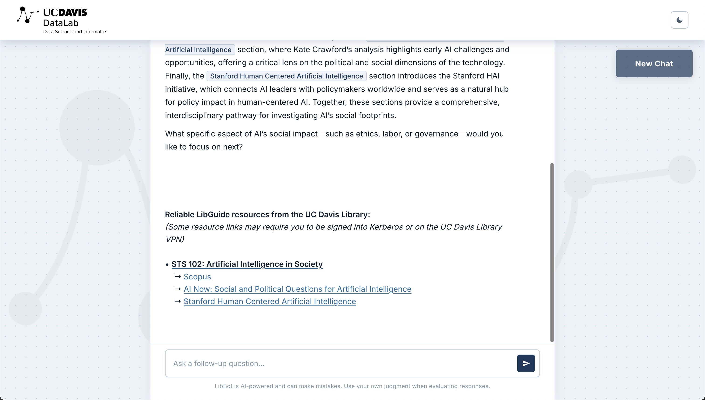

# LibBot: UC Davis Library LibGuide Chatbot

> [!IMPORTANT]  
> This project originated as a group collaboration back during 2025 Spring Quarter. The original team prototype was primarily built in R, along with Ollama; team member acknowledgements, resources and data store, and documentation can be found in the [[**v1.0b-STS195**]](https://github.com/datalab-dev/ucd_library_libguide_chatbot/tree/v1.0b-STS195) branch of this repository.

> [!NOTE]
> LibBot's corpus is based on UC Davis LibGuides scraped February 20th, 2025.
> Updated library data will be incorporated in future iterations.

## Current Contributors

-   **Project Lead**: Dr. Carl Stahmer
-   **Lead Developer & Maintainer**: Federico G. Aprile
-   **UX/UI Designer**: Leon Tanguay

<br>

---

## Project Overview

**LibBot** is a virtual librarian chatbot designed to bring together scattered academic resources into a unified research tool. Developed to support the UC Davis Library, it connects researchers with relevant materials and expertise, maintaining high-quality research support even amidst institutional constraints like reduced librarian availability. _**LibBot is currently deployed on the UC Davis DataLab server and accessible to users on the university VPN.**_

### Technical Implementation

The system transforms the UC Davis library’s corpus of guides and resources into a conversational experience through a structured RAG (Retrieval-Augmented Generation) pipeline:

- **Data Collection & Cleaning**: Systematized scraping and preprocessing of heterogeneous library data to ensure a clean, searchable corpus.
- **Semantic Representation**: Uses Sentence-Transformer models to generate high-quality vector embeddings for documents and queries. These models were benchmarked to balance computational efficiency on CPU-only environments with retrieval accuracy.
- **Retrieval & Context Selection**: A Python/PyTorch-based retrieval engine that uses optimized pooling strategies to identify and rank the most relevant document chunks based on user queries, using cosine similarity.
- **Retrieval-Augmented Generation (RAG)**: A prompt engineering layer that synthesizes the retrieved context and passes it to a Large Language Model (LLM) to generate natural, cited responses and links.

<br>

---

## Getting Started with LibBot

> [!TIP]
> **Accessing and Interacting with LibBot:**
> 1. Connect to the **UC Davis Library VPN**
> 2. Go to http://datasci.library.ucdavis.edu:8075

> [!NOTE]
> If the page doesn't load, verify you are connected to the UC Davis Library VPN.

> [!CAUTION]
> As with all large language model output, use your own critical reading and thinking skills to assess the validity and reliability of this response for your specific query.

<br>

> [!NOTE]
> - For maintainers needing to start or restart the server, see the [`Maintenance Guide`](https://github.com/datalab-dev/2025_startup_libguide_chatbot/blob/libbot/docs/maintenance.md).
> - To verify the package is working independently of the web server, run:
> ``` bash
> pixi run python test_retriever.py "your query here"
> ```

<br>

---
## Project Dependencies
This project uses `Pixi` for environment and dependency management on a Linux x86-64 server running Python 3.10. `Pixi` handles Python versioning, package installation, and task running — no manual pip install or conda environment setup needed. The full dependency list is defined in `pixi.toml`.

| Package | Purpose |
|--------|-------------|
| fastapi / uvicorn | REST API server and ASGI runtime |
| chromadb | Vector database for storing and querying embeddings |
| sentence-transformers / pytorch | Qwen3-Embedding model for query and document encoding |
| pydantic-settings | Request/response validation and .env-based configuration |
| httpx | Async HTTP client for communicating with Ollama |
| ollama | LLM inference (runs as a separate process — see Maintenance Guide) |

> [!NOTE]
> For full environment setup and server operation, see the [Maintenance Guide](https://github.com/datalab-dev/2025_startup_libguide_chatbot/blob/libbot/docs/maintenance.md).

<br>

---

## GitHub File and Directory Structure

``` bash
2025_startup_libguide_chatbot/
  ├── README.md                          # This README
  ├── docs
  │   ├── methodology.md                 # Doc - Methodology and Research Notes
  │   ├── maintenance.md                 # Doc - LibBot server maintenance/configuration
  │   ├── ollama.md                      # Doc - LLM configuration and Modelfiles
  │   └── assets                         # Images
  │       └── ...
  ├── libbot_pkg/                        # Main package - see dedicated README
  │   └── ...
  ├── research/                          # Model benchmarking — see dedicated README
  │   └── ...
  ├── models/                            # Ollama models — see dedicated README
  │   └── ...
  │
  ├── test_retriever.py                  # Testing whether libbot_pkg module imports work on a simple script
  ├── .gitignore/.gitattributes          # What files Git should not track, and how Git should handle the files it does track
  └── pixi.toml                          # Environment and dependency definitions
```
### [**Dedicated `libbot_pkg/` README**](https://github.com/datalab-dev/2025_startup_libguide_chatbot/tree/libbot/libbot_pkg)

### [**Dedicated `research/` README**](https://github.com/datalab-dev/2025_startup_libguide_chatbot/tree/libbot/research)

### [**Dedicated `models/` README**](https://github.com/datalab-dev/ucd_library_libguide_chatbot/blob/main/docs/ollama.md)

<br>

---

## Methodology
[**Dedicated `Methodology` Notes**](https://github.com/datalab-dev/ucd_library_libguide_chatbot/blob/main/docs/methodology.md) doc that covers the highlights of the research, considerations, and the decisions made at every step of this project--from working on the corpus, to experimenting with embedding models, facilitating retrieval, and more.

<br>

---

## Example LibBot Interaction:



